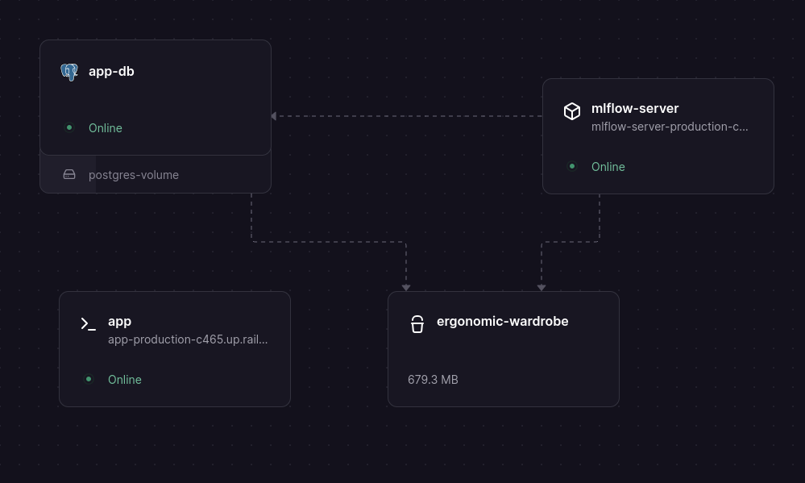
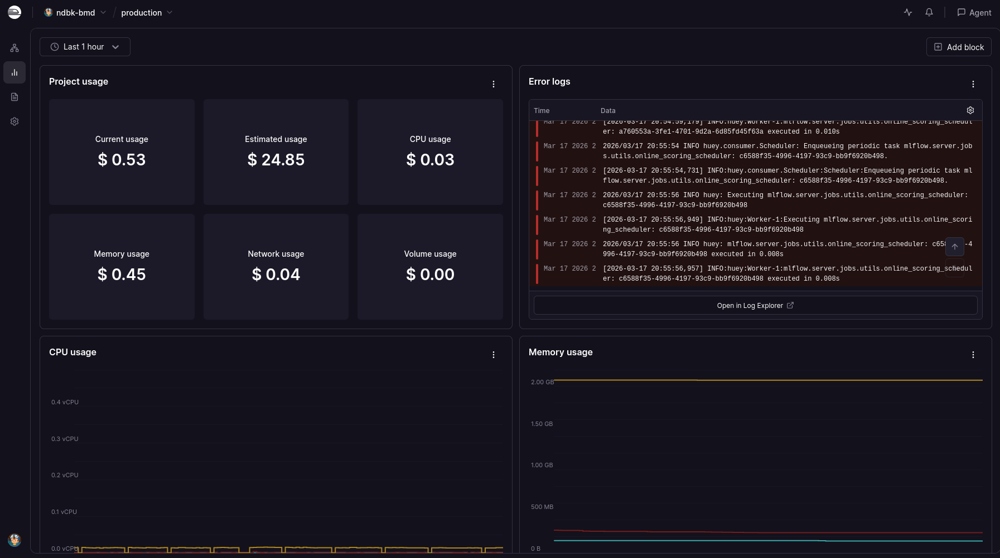
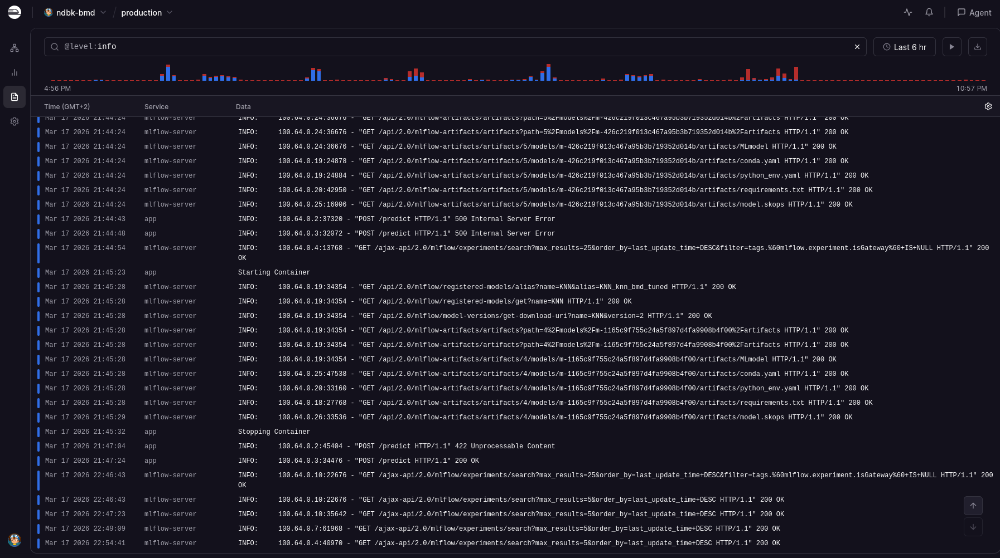

# Bank Marketing Data

A machine learning application designed to predict which clients are likely to sign up for a product.

## Overview

This project first preprocesses the bank marketing data and uses `dvc` to track the data. Hyperopt is used to tune the hyperparameters of the three models, namely K-Nearest Neighbors (`KNN`), Neural Networks (`NN`), and Random Forests (`RF`). MLflow is used to track the experiments and upload the best models to the MLflow Model Registry. The best model is then served using FastAPI. CI/CD pipelines are used to build, test and deploy the project. The project is hosted using [Railway](https://railway.app/) but can be deployed to a Kubernetes cluster.

## Setup & Installation

1. **Clone the repository:**
   ```bash
   git clone https://github.com/KyleErwin/ndbk-bmd/
   cd ndbk-bmd
   ```

2. **Install dependencies:**
   The project uses [uv](https://github.com/astral-sh/uv) for dependency management.
   ```bash
   uv sync
   ```

3. **Start the server:**
   ```bash
   uvicorn main:app --reload
   ```

## Usage

If you are running the application locally, you can use the following command to test the `/predict` endpoint:

```bash
curl --request POST \
  --url http://localhost:8000/predict \
  --header 'content-type: application/json' \
  --data '{
  "age": 30,
  "balance": 6000,
  "default": false,
  "housing": true,
  "loan": true,
  "campaign": 1,
  "job": "student",
  "marital": "married",
  "education": "primary",
  "previous": 1,
  "pcontacted": "never",
  "poutcome": "success"
}'
```

Alternatively, you can use the following command to test the `/predict` endpoint hosted on Railway:

```bash
curl --request POST \
  --url https://app-production-c465.up.railway.app/predict \
  --header 'content-type: application/json' \
  --data '{
  "age": 30,
  "balance": 6000,
  "default": false,
  "housing": true,
  "loan": true,
  "campaign": 1,
  "job": "student",
  "marital": "married",
  "education": "primary",
  "previous": 1,
  "pcontacted": "never",
  "poutcome": "success"
}'
```

## Assignment Details

This section details the experimental and engineering process I followed to complete the assignment.

### Problem 1

I used [python notebook](notebooks/analysis.ipynb) to explore the dataset and understand the problem. This provided several key insights:
- The class distribution is imbalanced.
- Very few duplicates were found in the dataset.
- `pdays` should be binned into more meaningful categories.
- `age` has outliers, e.g. a 130 year old client. Seems like a data capture error.
- Identified variables that are only known after client contact, i.e., `post_campaign_action` and `duration`, which constitute as data leakage.
- `month` (and by extension `day`) may be irrelevant since we may not always know when we will contact a client.

I also used the notebook to visualize the data, test data transformations, and perform model training. Once I was happy with my understanding of the data, I used Hyperopt (a hyperparameter optimization library) to tune the hyperparameters for K-Nearest Neighbors (KNN), Neural Networks (NN), and Random Forests (RF). This code is contained in [src/training/tuner.py](src/training/tuner.py). [src/training/dataset.py](src/training/dataset.py) is used to preprocess the data for both training and testing. The tuner objects use scikit-learn pipelines to perform the data transformations and model training. These pipelines include SMOTE for oversampling, and a standard scaler. I could not get the one hot encoder to work with the pipeline, so I performed one hot encoding using pandas. The objective function for Hyperopt is to minimize the cross-validation error (using roc_auc_score). MLflow is used to track the experiments and upload the best models to the MLflow Model Registry. 

To run the tuning process use
```
uv run python tune.py --model all
```

I found the Neural Network to be the best model, however it took the longest to make predictions. The KNN was the fastest to make predictions and was only slightly less accurate (with regard to roc_auc_score) than the Neural Network. For that reason, the service is deployed with the tuned KNN model. 

#### Discussion Points

**Monitoring** is required to detect any **data drift** by comparing the live feature distributions against training data. 

**Batch prediction** could be used to process large datasets of clients at scheduled intervals, providing the marketing team with a list of clients to contact. This approach is more efficient than real-time deployment since the market team isn't waiting for predictions.

**Ethical Considerations:** The model may exclude specific groups from opportunities, e.g. `unemployed` or `divorced` individuals. If "low-probability" groups are never contacted, the model never receives the data necessary to correct its own assumptions.

### Problem 2

I used [Railway](https://railway.app/) to host the application, an [MLflow server](https://mlflow-server-production-c6e7.up.railway.app/#/), a postgres database to store experimental runs and a bucket to store datasets and the best models. 



Railway was chosen over Azure to minimize costs and avoid unexpected expenses (since it is a managed service). However I wanted to show that I am comfortable with Kubernetes and have included manifests to deploy the application to a kubernetes cluster. Note that the kubernetes deployment only includes the FastAPI application.

The [scripts/setup-cluster.sh](scripts/setup-cluster.sh) script will create a kubernetes and [scripts/deploy.sh](scripts/deploy.sh) will deploy the application to it. 

You can then test the application using the following command:

```bash
kubectl -n ndbk-bmd-app port-forward svc/ndbk-bmd-app 8080:80

curl --request POST \
  --url http://localhost:8080/predict \
  --header 'content-type: application/json' \
  --data '{
  "age": 30,
  "balance": 6000,
  "default": false,
  "housing": true,
  "loan": true,
  "campaign": 1,
  "job": "student",
  "marital": "married",
  "education": "primary",
  "previous": 1,
  "pcontacted": "never",
  "poutcome": "success"
}'
```

#### Monitoring and Logs
Monitoring and logs are managed using Railway. 






#### Other Considerations:
- GitHub Actions is used to automate the CI/CD pipelines. Ideally, scripts like [scripts/preprocess-data.sh](scripts/preprocess-data.sh) and [scripts/train.sh](scripts/train.sh) would be triggered by tag release or manual action, but they would eat at my compute budget, especially since training can take a while.
- `uv` is used for dependency management.
- `ruff` is used for linting and code formatting.
- `ty` is used for type checking.
- `dvc` is used to track the data. See [scripts/preprocess-data.sh](scripts/preprocess-data.sh).
- Secrets are managed using Railway, but could be managed using something like [HashiCorp Vault](https://www.vaultproject.io/).
- Prometheus and Grafana could also be used to monitor the application.
- There are some hardcoded environment variables, e.g. `mlflow` server url, `model_name` and `alias`. These aren't secrets but rather metadata. Still, these should be loaded in, e.g. from a config file or environment variables, but I have left them hardcoded so the reviewer can easily run the project.