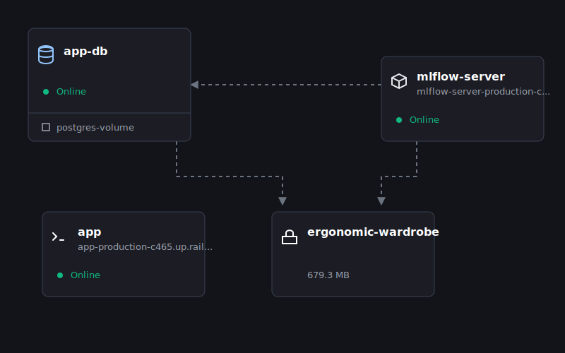

# Bank Marketing Data Application

A machine learning application designed to predict which clients are likely to sign up for a product.

---

## Data Analysis & Insights

- **Imbalance**: The class distribution is heavily imbalanced with a ratio of 7.67.
- **Data Quality**:
  - Missing numeric values were imputed using the median.
  - Missing categorical values were imputed using the mode.
  - 23 duplicates were found and removed.
  - Potential data capture errors like an age outlier of 131 were noted.
- **Feature Engineering**:
  - `pdays` was binned into categories like never, within a week, within a month, etc.
  - Data leakage variables (`post_campaign_action` and `duration`) were dropped.
  - Categorical variables were one-hot encoded.

---

## Machine Learning Pipeline

### Preprocessing & Handling Imbalance
- **SMOTE (Synthetic Minority Over-sampling Technique)** is applied within the scikit-learn pipeline to oversample the minority class on the training data.
- **StandardScaler** is used to scale features appropriately.

### Model Selection
- We utilized **Hyperopt** (a hyperparameter optimization library) to tune models:
  - **K-Nearest Neighbors (KNN)**
  - **Neural Networks (NN)**
  - **Random Forests (RF)** (used as a baseline during initial tests with ~0.6965 test ROC-AUC)

---

## Model Evaluation

- The **Neural Network** achieved the best predictive performance but had the highest inference time.
- The **KNN** was chosen for deployment as it provided the fastest prediction time while maintaining comparable accuracy (evaluated using `roc_auc_score`).
- **MLflow** tracks experiments, records trial parameters and metrics, and stores the best models into its Model Registry.

---

## Deployment Architecture

The application is deployed using Railway to minimize costs, featuring:
- **FastAPI**: Serves the model through a `/predict` endpoint.
- **Railway**: Manages hosting for the app, PostgreSQL db, and MLflow server.
- **S3 Bucket**: Stores tracked datasets and MLflow model artifacts.

---

## Future Considerations

- **Monitoring**: Essential to detect data drift by comparing live feature distributions against training data.
- **Batch Predictions**: Processing large datasets at intervals could be more efficient than real-time for marketing teams.
- **Ethical Factors**: The model may exclude specific groups (e.g., unemployed). If not addressed, this feedback loop prevents the model from correcting biased assumptions.